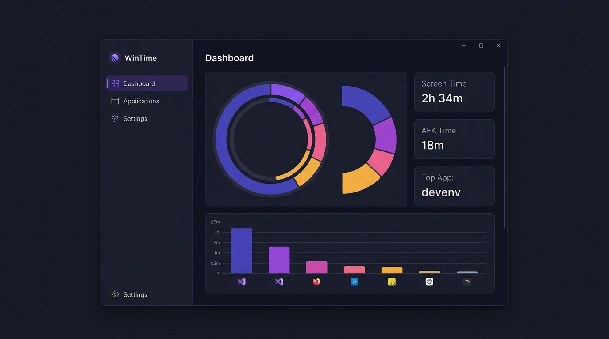

<div align="center">
  <h1>⏱ WinTime</h1>
  <p><strong>Lightweight screen time tracker for Windows</strong></p>
  <p>Know exactly where your time goes — by app, by hour, by day.</p>

  
  
  
  

  <br/>

</div>

---

## What is WinTime?

WinTime runs silently in your system tray and tracks which applications you use and for how long. No cloud, no telemetry — everything stays in a local SQLite database on your machine.

---

## Features

| Feature | Details |
|---|---|
| **Automatic tracking** | Detects the active foreground window every second |
| **AFK detection** | Marks idle periods when no mouse/keyboard input is detected |
| **Dashboard** | Summary cards + donut chart (top 5 apps) + hourly/daily/monthly bar chart |
| **Applications list** | View, rename, and categorize every tracked app |
| **Blacklist** | Exclude apps you don't want tracked |
| **Data export** | Export activity history to CSV or JSON |
| **System tray** | Runs minimized; window closes to tray instead of exiting |
| **Single instance** | Only one copy of WinTime can run at a time |
| **Startup option** | Optionally launch WinTime with Windows |
| **Local-only** | All data stays on your machine in a SQLite `.db` file |

---

## Screenshots

> Dashboard · Applications · Settings

<div align="center">

</div>

---

## Tech Stack

- **UI** — WPF (.NET 10, C# 13)
- **Charts** — [LiveChartsCore](https://livecharts.dev/) 2.0.5 (SkiaSharp)
- **Database** — SQLite via [Microsoft.Data.Sqlite](https://learn.microsoft.com/en-us/dotnet/standard/data/sqlite/) 10.0 + [Dapper](https://github.com/DapperLib/Dapper) ORM
- **Fluent UI** — [WPF UI](https://wpfui.lepo.co/) 3.1
- **Tray icon** — [Hardcodet.NotifyIcon.Wpf](https://github.com/hardcodet/wpf-notifyicon) 1.1
- **Export** — [CsvHelper](https://joshclose.github.io/CsvHelper/) 33
- **Architecture** — MVVM (BaseViewModel + RelayCommand, no framework)

---

## Requirements

- Windows 10 / 11 (x64)
- [.NET 10 Runtime](https://dotnet.microsoft.com/en-us/download/dotnet/10.0) (or SDK if building from source)

---

## Getting Started

### Run from source

```bash
git clone
cd WinTime
dotnet run -p:Platform=x64
```

### Build with Visual Studio

1. Open `WinTime.sln` in **Visual Studio 2022** (v17.10+)
2. Set configuration to **Debug | x64**
3. Right-click the project → **Set as Startup Project**
4. Press **F5**

### First launch

On first launch WinTime asks you to choose a location for the `.db` database file. After that it starts tracking immediately and minimizes to the tray.

---

## Project Structure

```
WinTime/
├── Core/               # BaseViewModel, RelayCommand, SystemStartupManager
├── Data/               # DatabaseService, ApplicationRepository, ActivityRepository
├── Models/             # AppModel, AppStatItem, ActivitySession
├── Services/           # SettingsService, ActivityTracker, IconService, ExportService, InMemoryBuffer
├── ViewModels/         # MainWindowViewModel, DashboardViewModel, ApplicationsViewModel, SettingsViewModel
├── Views/              # MainWindow, DashboardView, ApplicationsView, SettingsView, FirstRunDialog
├── Converters/         # BooleanToVisibilityConverter
├── AppServices.cs      # Static service locator / DI container
├── App.xaml.cs         # Startup, tray icon, single-instance mutex
└── WinTime.csproj
```

---

## Privacy

WinTime is **100% local**. No data ever leaves your machine. No analytics, no crash reporting, no network requests.

---